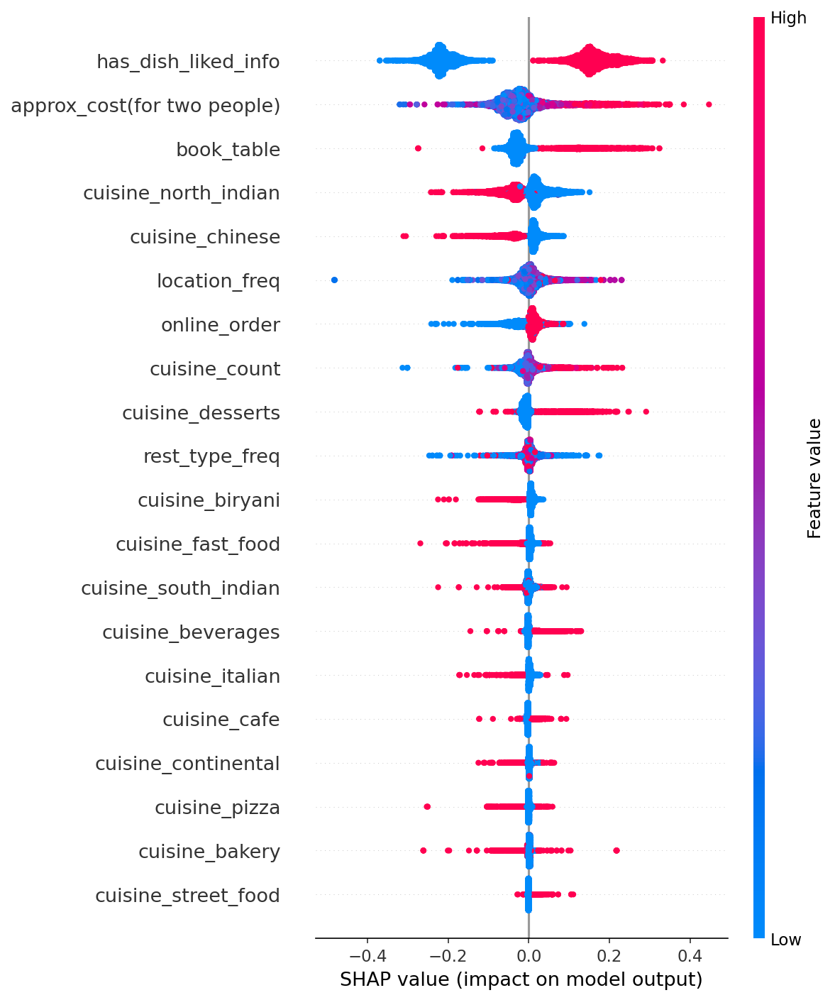

# Zomato Restaurant Rating Prediction

Predicting a restaurant's rating from its attributes (cost, cuisine, location, votes, online order/table booking availability) using the [Zomato Bangalore Restaurants dataset](https://www.kaggle.com/datasets/himanshupoddar/zomato-bangalore-restaurants).

## Problem Statement

Given information about a restaurant listed on Zomato, can we predict its expected rating -- and more importantly, understand *which factors actually drive that rating*? This isn't just a prediction task; the explainability side (via SHAP) is what turns this into a genuinely useful analysis rather than a black-box score.

## Dataset Overview

~51,000 restaurant listings in Bangalore, with fields including cost for two, cuisines served, location, restaurant type, online order/table booking availability, votes, and rating.

## Key EDA Insights

*(fill in with your actual findings once you re-run `01_eda.ipynb` -- a few likely candidates based on the analysis:)*

- Restaurants with online order enabled tend to have [higher/lower] average ratings than those without
- 
- Certain cuisines (e.g. Cantonese, African, Japanese) show notably higher average ratings, though often with fewer restaurants serving them
- Cost and rating show a [weak/moderate] positive correlation -- see the correlation heatmap:
- 

## Feature Engineering

| Original Column | Transformation |
|---|---|
| `online_order`, `book_table` | Binary encoded (Yes/No -> 1/0) |
| `votes` | Log-transformed (right-skewed distribution) |
| `location`, `rest_type` | Frequency encoded (too high-cardinality for one-hot) |
| `cuisines` | Top-15 cuisines one-hot encoded + `cuisine_count` feature |
| `listed_in(type)` | One-hot encoded |
| `dish_liked` | Dropped (54% missing) -- replaced with a `has_dish_liked_info` presence flag |

## Models Compared

| Model | RMSE | R² |
|---|---|---|
| Linear Regression | *0.25071* | *0.673352* |
| Random Forest | *0.257337* | *0.655856* |
| XGBoost | *0.333629* | *0.421554*|

Full comparison table generated automatically at `reports/model_comparison.md` after running `03_modeling.ipynb`.

## Explainability (SHAP)



*(Key takeaway -- fill in after running: which features push predicted rating up or down the most? e.g. "Votes and cost had the strongest influence on predicted rating, while online order availability had a smaller effect than expected.")*

## Project Structure

```
zomato-rating-prediction/
├── data/
│   ├── raw/              # Original zomato.csv (not committed -- see below)
│   └── processed/        # Cleaned data + feature matrix
├── notebooks/
│   ├── 01_eda.ipynb                 # Exploratory analysis
│   ├── 02_feature_engineering.ipynb # Builds model-ready features
│   └── 03_modeling.ipynb            # Trains, compares, and explains models
├── src/
│   ├── data_cleaning.py       # Cleaning functions used in 01_eda.ipynb
│   ├── feature_engineering.py # Encoding logic used in 02
│   ├── train.py               # Model training + comparison
│   └── evaluate.py            # SHAP explainability
├── models/                # Saved best model (.pkl)
├── reports/
│   ├── figures/            # Saved plots (EDA + SHAP)
│   └── model_comparison.md
└── app/
    └── streamlit_app.py    # Interactive rating predictor demo
```

## How to Run

```bash
# 1. Install dependencies
pip install -r requirements.txt

# 2. Add the raw dataset
# Download from Kaggle and place at: data/raw/zomato.csv

# 3. Run the pipeline (either via notebooks in order, or directly via src/)
python src/data_cleaning.py
python src/feature_engineering.py
python src/train.py
python src/evaluate.py

# 4. Try the interactive demo
streamlit run app/streamlit_app.py
```

## Tech Stack

Python, pandas, scikit-learn, XGBoost, SHAP, Streamlit

## Next Steps / Possible Extensions

- Hyperparameter tuning (GridSearchCV/Optuna) on the XGBoost model
- Try target encoding instead of frequency encoding for `location`/`rest_type` and compare performance
- Deploy the Streamlit app publicly (Streamlit Community Cloud)
